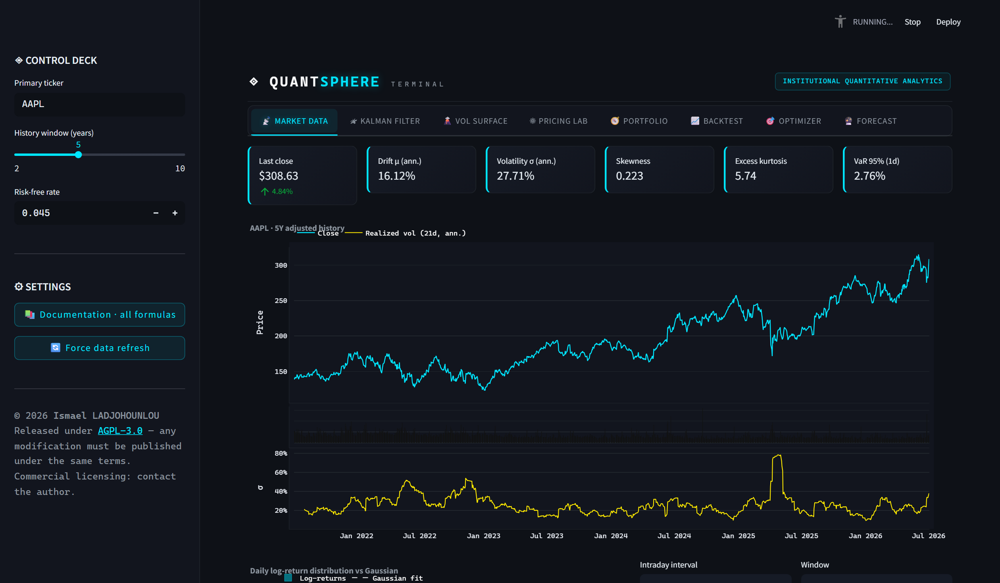
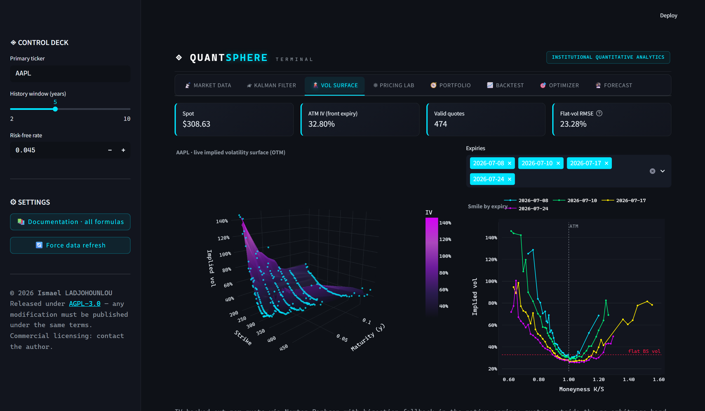
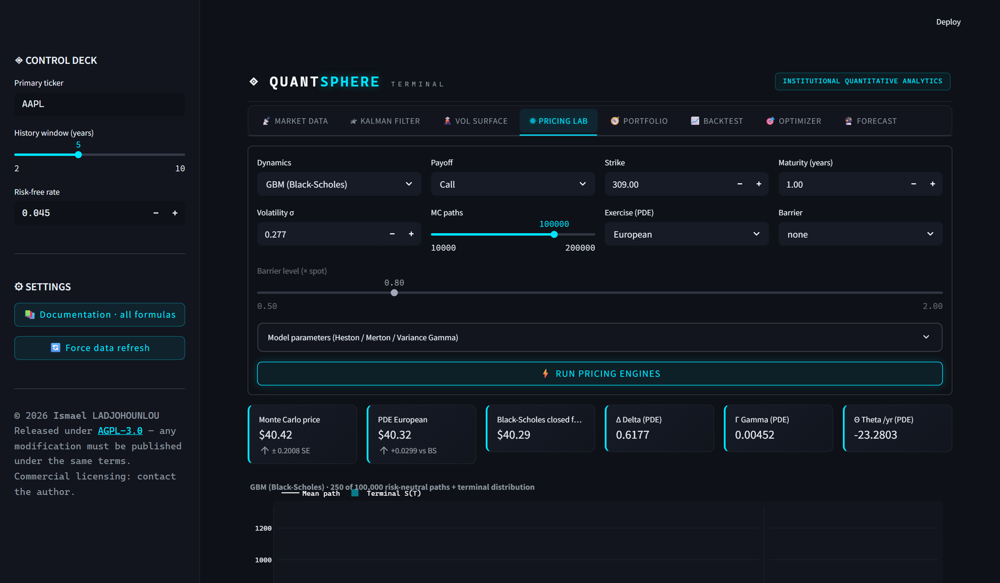
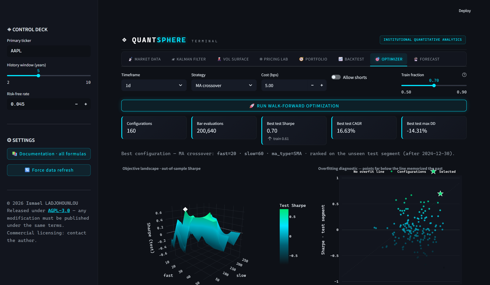

<div align="center">

# ◈ QuantSphere Terminal

### Institutional-grade quantitative analytics — C++20 numerical core, Python orchestration, live market data

[](LICENSE)
[](engine/)
[](requirements.txt)
[](app.py)
[](tests/)

*Eight live pipeline stages: market data → Kalman filtering → volatility surfaces → derivative pricing → portfolio construction → backtesting → walk-forward optimization → probabilistic forecasting. Every formula documented, every number cross-verified.*

**[Screenshots](#-screenshots) · [Quickstart](#-quickstart) · [Architecture](#-architecture) · [Methodology](#-methodology--verification) · [License](#-license--author)**

</div>

---

## Why this exists

Quantitative finance tooling is either locked inside institutions (Bloomberg, in-house desk libraries) or scattered across academic notebooks that never touch live data. **QuantSphere Terminal closes that gap**: a single auditable platform where the models of the standard quant curriculum — Black-Scholes PDEs, Heston, jump-diffusions, Kalman filters, GARCH, Markowitz — run **natively in C++** against **real market data**, with the mathematics of every displayed number documented in-app.

It industrializes the excellent notebook collection [cantaro86/Financial-Models-Numerical-Methods](https://github.com/cantaro86/Financial-Models-Numerical-Methods) into a production system.

## ✨ The eight stages

| Stage | What it does | The hard part underneath |
|---|---|---|
| 📡 **Market Data** | 10y daily + intraday bars (1m–1h), VWAP, drift/vol/skew/kurtosis, historical VaR | Session-aware axes (no phantom overnight moves), vendor-failure retries |
| 🛰 **Kalman Filter** | Latent price & drift extraction with ±2σ bands, h-step-ahead prediction | Exact linear-Gaussian filter + RTS smoother in C++; innovation whiteness diagnostics |
| 🌋 **Vol Surface** | Live options chain → 3-D implied volatility surface + smiles by expiry | Newton–Raphson IV with analytic vega and guaranteed bisection fallback; no-arbitrage quote rejection |
| ⚛ **Pricing Lab** | European / American / barrier options under 4 dynamics, Greeks, VaR | Multithreaded Monte Carlo (GBM, Heston, Merton, Variance Gamma) vs Crank–Nicolson PDE (Thomas / PSOR) vs closed form — three engines, one screen |
| 🧭 **Portfolio** | Efficient frontier, tangent & min-variance portfolios, capital market line | SLSQP over ridge-regularized covariance; **realized** performance curves of the weights and a deploy-ready $-allocation table |
| 📈 **Backtest** | 5 causal strategies × 5 timeframes, costs, lot sizing, trend & volume filters | Strict 1-bar execution lag; a clairvoyant-signal test proves zero look-ahead mechanically |
| 🎯 **Optimizer** | Hyperparameter sweeps with 3-D objective landscapes and overfitting diagnostics | Chronological walk-forward split — configurations are ranked **only on data they never saw** |
| 🔮 **Forecast** | Probabilistic price cones, GARCH(1,1) vol term structure, 3-D forward density | Exact MLE GARCH; circular block bootstrap preserving fat tails; honest quantiles, not point predictions |

Plus **📚 in-app documentation** (⚙ Settings): 40+ LaTeX formulas — model equations, estimators, numerical schemes, assumptions and model risk — the full methodology the platform can be audited against.

## 📸 Screenshots

| | |
|---|---|
|  |  |
| *Live market ingestion & statistics* | *3-D implied volatility surface from the live chain* |
|  |  |
| *Monte Carlo vs PDE vs closed form* | *Walk-forward optimization landscape* |

## 🚀 Quickstart

```bash
git clone https://github.com/<you>/quantsphere-terminal.git
cd quantsphere-terminal
pip install -r requirements.txt
streamlit run app.py
```

That's it — the platform boots on the NumPy engine everywhere (including Streamlit Community Cloud / Hugging Face Spaces). No API keys: market data is Yahoo Finance.

### Unlock the native C++ engine (optional, ~10× faster Monte Carlo)

```bash
pip install pybind11
cmake -S engine -B engine/build -DPYBIND11_FINDPYTHON=ON \
      -DPython_EXECUTABLE="$(which python)"
# Windows: add  -G "Visual Studio 17 2022" -A x64
cmake --build engine/build --config Release
# copy the built qsengine.* module next to quantsphere/__init__.py
```

Both engines expose an identical API and are cross-verified against each other to 10⁻¹⁴ in the test suite — the app transparently uses whichever is available.

## 🏗 Architecture

```
┌──────────────────────────────────────────────────────────────┐
│  app.py — Streamlit terminal (institutional dark theme)      │
├──────────────────────────────────────────────────────────────┤
│  quantsphere/ — Python orchestration                         │
│    data.py       ingestion, cleansing, stats (retry-hardened)│
│    backtest.py   causal vectorized backtester                │
│    optimize.py   walk-forward hyperparameter search          │
│    models.py     GARCH(1,1) MLE, EWMA, forecast cones        │
│    portfolio.py  Markowitz MVO (SLSQP, long-only)            │
│    engine.py     dispatch: native C++ ⇄ NumPy fallback       │
│    _fallback.py  API-identical NumPy mirror                  │
├──────────────────────────────────────────────────────────────┤
│  engine/ — C++20 core (pybind11, GIL released, multithreaded)│
│    mc.hpp      Monte Carlo: GBM · Heston · Merton · VG       │
│    pde.hpp     Crank–Nicolson + Thomas O(N) / PSOR (American)│
│    kalman.hpp  Kalman filter + RTS smoother                  │
│    iv.hpp      implied volatility: Newton + bisection        │
└──────────────────────────────────────────────────────────────┘
```

Design decisions that matter:

- **Deterministic parallelism** — Monte Carlo work is split into 64 fixed units seeded via splitmix64: results are bit-identical on any machine, any thread count.
- **Two implementations of everything numerical** — the C++ core and the NumPy fallback agree to 10⁻¹⁴ on deterministic algorithms; disagreement is a test failure, not a shrug.
- **Causality as an invariant** — every trading signal is verified bit-identical when future data is truncated; the backtester's clairvoyant-signal test earns exactly $0 on information it shouldn't have.
- **Risk-neutral ≠ real-world** — pricing simulates under ℚ, forecasting under ℙ with an explicit drift choice; the docs explain why you must never read a pricing fan as a prediction.

## 🔬 Methodology & verification

```bash
python tests/test_engine.py   # 43 checks — numerical engines
python tests/test_quant.py    # 45 checks — backtester, optimizer, forecasting
```

88 network-free checks, including:

- Black-Scholes closed-form values and put-call parity to machine precision
- Implied-vol round-trips at 10⁻¹³; arbitrage-violating quotes rejected
- Monte Carlo within standard error of closed form for **all four dynamics**
- Exact path-wise barrier in/out parity (`V_KO + V_KI = V_vanilla`)
- PDE vs closed form at 4×10⁻⁵ relative; American ≥ European ≥ intrinsic
- Kalman/RTS native ≡ fallback at 10⁻¹⁴
- **Look-ahead guards**: clairvoyant signals earn zero; all signals causal under truncation
- GARCH(1,1) parameter recovery on simulated data (α within 0.05 of truth)
- Optimizer test scores equal an independent out-of-sample replay at 10⁻⁹

## ☁️ Deploy your own

**Streamlit Community Cloud** (free): fork → [share.streamlit.io](https://share.streamlit.io) → point at `app.py`. The NumPy engine activates automatically.

**Hugging Face Spaces**: create a Streamlit Space, push this repo.

> ⚠️ Under AGPL-3.0, any publicly served modified version must publish its source.

## ⚖️ License & author

**Réalisé par Ismael LADJOHOUNLOU** — © 2026.

Licensed under the **GNU Affero General Public License v3.0** ([LICENSE](LICENSE)):

- ✅ Free to use, study, self-host and modify
- 🔁 **Any modified version that is distributed — or offered as a network service — must publish its complete source code under the same license**
- 🚫 Proprietary resale is therefore impossible without a separate commercial license
- 💼 Commercial licensing available from the author

## ⚠️ Disclaimer

QuantSphere Terminal is a research and educational instrument. Market data comes from public sources and may be delayed or inaccurate. Backtests are in-sample research artifacts, not promises. **Nothing produced by this software constitutes investment advice.**

---

<div align="center">
<sub>Built on the shoulders of Black–Scholes–Merton, Heston, Bollerslev, Harvey, Markowitz — and <a href="https://github.com/cantaro86/Financial-Models-Numerical-Methods">cantaro86</a>'s notebooks. Full references in the in-app documentation.</sub>
</div>

---

<details>
<summary><b>🔎 Keywords & topics covered by this project</b></summary>

**Institutional trading system** · quantitative finance platform · quant terminal · algorithmic trading system · quantitative analysis software · financial engineering toolkit · quant research platform

**Derivatives & pricing**: options pricing engine · Black-Scholes model · Black-Scholes PDE solver · Crank-Nicolson finite differences · American options (PSOR / linear complementarity) · barrier options (knock-in, knock-out) · exotic options · Monte Carlo simulation · Heston stochastic volatility · Merton jump-diffusion · Variance Gamma process · Lévy processes · option Greeks (delta, gamma, theta) · risk-neutral pricing

**Volatility & forecasting**: implied volatility solver (Newton-Raphson) · 3D volatility surface · volatility smile & skew · options chain analysis · GARCH(1,1) maximum likelihood · EWMA / RiskMetrics · volatility forecasting · probabilistic price forecasting · forecast cones · block bootstrap · Value-at-Risk (VaR) · Expected Shortfall (CVaR)

**Signal processing & strategies**: Kalman filter trading · RTS smoother · state-space models · latent drift estimation · trend following · mean reversion · moving average crossover (SMA/EMA) · volatility targeting · trading signal filters · VWAP

**Backtesting & optimization**: vectorized backtesting engine · look-ahead bias prevention · walk-forward analysis · out-of-sample validation · hyperparameter optimization · overfitting diagnostics · Sharpe ratio · Sortino · Calmar · maximum drawdown · transaction cost modeling · multi-timeframe backtesting

**Portfolio**: Markowitz mean-variance optimization · efficient frontier · maximum Sharpe portfolio · minimum variance portfolio · capital market line · covariance regularization · asset allocation

**Technology**: C++20 quantitative library · pybind11 bindings · high-performance computing · multithreaded Monte Carlo · NumPy · SciPy · pandas · Streamlit dashboard · Plotly 3D visualization · yfinance market data · Python quant stack

</details>
